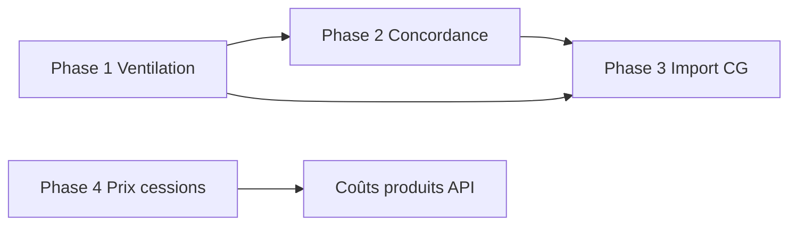

# Plan backend — Ventilation, concordance et import CG

Document de cadrage pour remplacer la persistance `localStorage` du module analytique frontend (post-Sprint 5).

## Contexte

| Module frontend | Store actuel | Hook |
|-----------------|--------------|------|
| Ventilation charges | `charges-ventilees-store.ts` | `useChargesVentilees` |
| Lignes concordance | `methodes-couts-store.ts` | `useConcordanceApi` |
| Prix de cessions | `methodes-couts-store.ts` | page prix-cessions |
| Import CG | `import-flux-cg.ts` (simulé) | configuration / écritures |

Calculs partagés côté frontend : `concordance-calculs.ts` (à migrer partiellement côté serveur pour cohérence multi-utilisateur).

---

## Phase 1 — Ventilation des charges (priorité haute)

### Objectif

Persister les charges ventilées depuis la CG vers la CA, avec lignes axe/centre/%.

### Modèle de données

```
charges_ventilees
  id UUID PK
  organization_id UUID NOT NULL
  charge_source_id VARCHAR(255)      -- ref écriture/ligne CG
  compte_cg VARCHAR(20) NOT NULL
  libelle VARCHAR(500) NOT NULL
  montant_total NUMERIC(18,2) NOT NULL
  incorporable BOOLEAN NOT NULL DEFAULT true
  periode_id UUID NOT NULL           -- FK periodes_analytiques
  periode_cg_id UUID                 -- traçabilité période CG
  created_at, updated_at, created_by

ventilations_charge
  id UUID PK
  charge_ventilee_id UUID NOT NULL FK
  axe_id UUID NOT NULL               -- FK axes analytiques
  centre_id UUID NOT NULL            -- FK axes (type CENTRE_COUT)
  pourcentage NUMERIC(5,2) NOT NULL
  UNIQUE(charge_ventilee_id, axe_id, centre_id)
```

**Contraintes métier (service)** :
- Si `incorporable = true` → somme des `pourcentage` = 100 (±0,01).
- Si `incorporable = false` → aucune ligne de ventilation.
- Comptes 661/671 → non incorporables par défaut (aligné règles incorporation).

### API REST

Base : `/api/accounting/analytique/charges-ventilees`

| Méthode | Route | Description |
|---------|-------|-------------|
| GET | `/` | Liste (`?periodeId=`, `?incorporable=`) |
| GET | `/{id}` | Détail + ventilations |
| POST | `/` | Créer charge + ventilations |
| PUT | `/{id}` | Modifier |
| DELETE | `/{id}` | Supprimer |
| GET | `/stats` | KPIs par période (totaux inc/non-inc/ventilé) |

DTO alignés sur `ChargeVentilee` / `VentilationAxe` du frontend (`mock-data.ts`).

### Frontend (Sprint 6a)

1. `AccountingChargesVentileesService.ts` + DTOs + mappers.
2. Refactor `useChargesVentilees` : API + repli localStorage (comme écritures).
3. Retirer la bannière « persistées localement » quand API OK.

### Estimation

Backend : 3–4 j · Frontend : 1–2 j · Tests : 1 j

---

## Phase 2 — Concordance CG/CA (priorité haute)

### Objectif

Stocker les lignes manuelles de concordance et exposer le calcul serveur pour les états.

### Modèle de données

```
lignes_concordance
  id UUID PK
  organization_id UUID NOT NULL
  periode_id UUID NOT NULL
  type VARCHAR(40) NOT NULL          -- CHARGE_NON_INC, PRODUIT_SUPPLETIF, …
  label VARCHAR(255) NOT NULL
  description TEXT
  signe CHAR(1) NOT NULL             -- '+' ou '-'
  montant NUMERIC(18,2) NOT NULL
  charge_ventilee_id UUID NULL FK    -- lien optionnel
  auto_generee BOOLEAN DEFAULT false -- true si générée depuis charges non-inc
  created_at, updated_at
```

**Note** : les lignes auto (charges non incorporables) peuvent rester calculées à la volée côté serveur ; seules les lignes manuelles sont persistées.

### API REST

Base : `/api/accounting/analytique/concordance`

| Méthode | Route | Description |
|---------|-------|-------------|
| GET | `/periodes/{periodeId}` | Lignes manuelles + résultat calculé |
| PUT | `/periodes/{periodeId}/lignes` | Remplacer lignes manuelles (batch) |
| POST | `/periodes/{periodeId}/lignes` | Ajouter une ligne |
| DELETE | `/lignes/{id}` | Supprimer |
| GET | `/periodes/{periodeId}/calcul` | **Read-only** — retourne `ConcordanceResult` |

### Calcul serveur (`ConcordanceService`)

Entrées :
- Période analytique + période CG liée (via `periodes-alignees` existant).
- Charges ventilées (Phase 1).
- Écritures validées (`EcritureAnalytiqueService`).
- Coûts produits (Phase 4 — mock acceptable en v1).

Sortie (miroir `ConcordanceResult` frontend) :
- `resultCG`, `totalNonInc`, `sommeDiff`, `resultCA`, `ecartVerif`, `concordanceOk`, `lignes` (fusion auto + manuelles).

### Frontend (Sprint 6b)

1. Service + hook `useConcordanceApi` branché API.
2. `use-etats-analytiques-api` consomme `GET …/calcul`.
3. Suppression persistance localStorage concordance.

### Estimation

Backend : 3 j · Frontend : 1–2 j

---

## Phase 3 — Import comptabilité générale (priorité moyenne)

### Objectif

Remplacer `importFluxDepuisCG()` simulé par un vrai flux CG → écritures analytiques brouillon.

### API REST

```
POST /api/accounting/analytique/ecritures/import-cg
Body: { periodeId?: UUID, exerciceId?: UUID, force?: boolean }
Response: { created: EcritureAnalytiqueDto[], ignored: number, errors: string[] }
```

**Logique métier** :
1. Lire écritures/lignes CG classe 6 (module comptabilité générale — à identifier).
2. Appliquer règles incorporation (`regles_incorporation` — Phase ultérieure ou table existante).
3. Créer écritures `origine=IMPORT_CG`, `statut=BROUILLON`.
4. Ignorer doublons (`ecriture_cg_ref` déjà importée).
5. Ignorer lignes non incorporables (comptabilisées via concordance).

### Frontend

- `configuration/page.tsx` et `ecritures/page.tsx` : appeler l’endpoint au lieu du mock.
- Retirer le guard `if (!usingMockFallback)` sur l’import.

### Estimation

Backend : 5–7 j (dépend accès CG) · Frontend : 1 j

---

## Phase 4 — Prix de cessions (priorité moyenne)

Base : `/api/accounting/analytique/prix-cessions`

Tables : `prix_cessions_internes`, `prix_cession_versions` (historisation).

Endpoints CRUD + contrainte unicité (cédant, bénéficiaire, prestation, actif).

Frontend : remplacer `listPrixCessions` / `savePrixCessions`.

Estimation : 3–4 j backend · 1 j frontend.

---

## Ordre de livraison recommandé



| Sprint | Contenu |
|--------|---------|
| **6a** | Ventilation backend + hook frontend |
| **6b** | Concordance backend + alignement états |
| **7** | Import CG réel |
| **8** | Prix cessions + début coûts produits |

---

## Alignement code existant backend

Réutiliser les patterns de :
- `CleRepartitionController` / `CleRepartitionLigne` (entité parent + lignes enfants).
- `EcritureAnalytiqueController` (filtres par période, statut).
- `ApiResponseWrapper`, validation Jakarta, multi-tenant `organization_id`.

Migrations Flyway/Liquibase : préfixer tables `analytique_*` ou garder snake_case cohérent (`charges_ventilees`).

---

## Critères d’acceptation globaux

- [ ] Plus de `localStorage` pour ventilation et concordance en prod.
- [ ] Deux utilisateurs voient les mêmes données après refresh.
- [ ] Concordance page + onglet états affichent le même calcul (source serveur).
- [ ] Import CG crée des brouillons visibles sur `/ecritures/validation`.
- [ ] Repli mock frontend conservé si API indisponible (bannière amber).

---

## Hors scope immédiat

- Plans analytiques API
- Coûts produits / fiches standards persistés
- Valorisation stocks, charges analytiques, méthodes de coût
- Module `/couts-pretablis` (données hardcodées)
